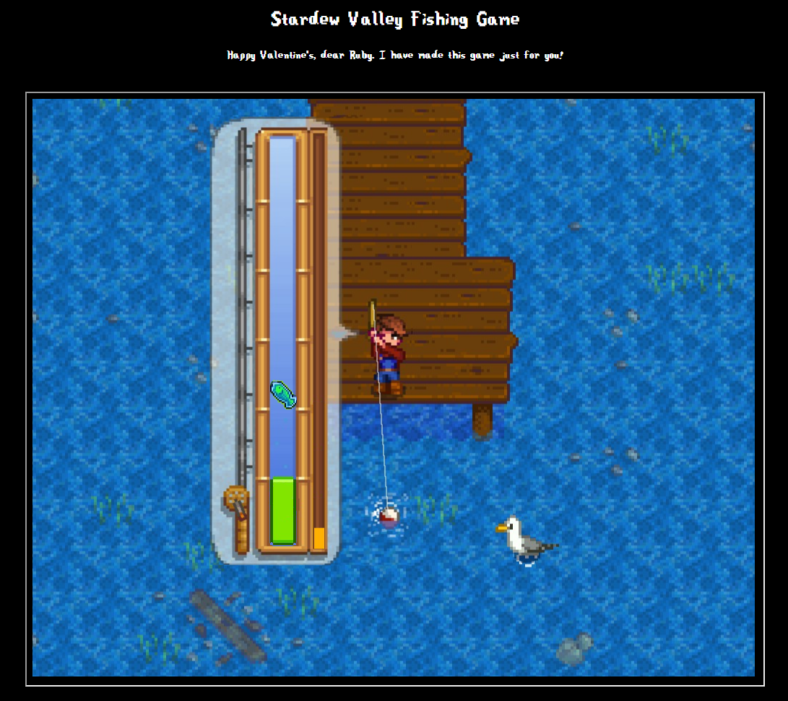

# Valentine's Gift - Stardew Valley Fishing Mini Game

## About
With Valentine's coming up, I was thinking of what gift to give to my girlfriend. I knew she liked Stardew Valley, as we are currently playing it. Especially how she told me she always liked the fishing mini-game.

So, here we go, a ***very*** dodgy implementation of the fishing game. Complete with missing animations and sound. I made this in less than a day's worth of time. This was my very first attempt at using Phaser 3, which I enjoyed very much working with.

If I were to make this again, I would perhaps start earlier. Bad jokes aside, I would create a couple more demo games in Phaser 3 or even another game engine like Godot. This would give me the confidence to deliver a more polished game. Plus, I would need to work more on the asset part (sprites, animations, sound, etc.).

Feel free to modify this and make it better, and perhaps give it to someone you like.




## Tools Used
These are the tools used:
- React (JavaScript)
- Vite
- Phaser 3
- ChatGPT 3.5

## How to Run
Installation steps are simple. Just follow these commands:
```
git clone git@github.com:mushi333/valentines-gift.git
cd valentines-gift
npm install
npm run dev
```

## Credit
The assets used were taken from the game "Stardew Valley", and all rights belong to the original game creator, ConcernApe. A link to buy the game can be found here - [Stardew Valley](https://www.stardewvalley.net/)
